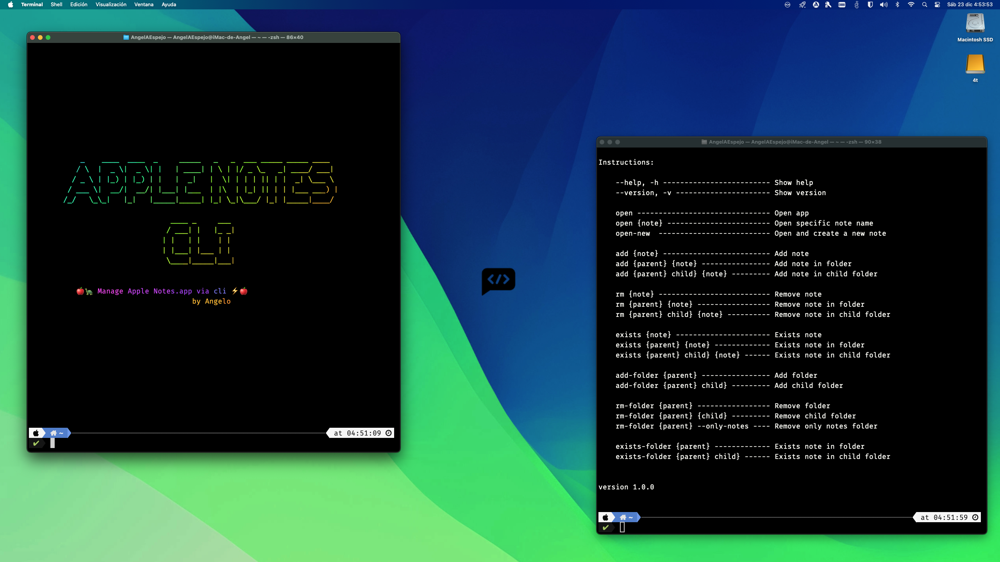

<!--

 █████╗ ███╗   ██╗ ██████╗ ███████╗██╗      ██████╗   
██╔══██╗████╗  ██║██╔════╝ ██╔════╝██║     ██╔═══██╗  
███████║██╔██╗ ██║██║  ███╗█████╗  ██║     ██║   ██║  
██╔══██║██║╚██╗██║██║   ██║██╔══╝  ██║     ██║   ██║  
██║  ██║██║ ╚████║╚██████╔╝███████╗███████╗╚██████╔╝  
╚═╝  ╚═╝╚═╝  ╚═══╝ ╚═════╝ ╚══════╝╚══════╝ ╚═════╝   
                                                                                                                                                              
█████╗█████╗█████╗█████╗█████╗█████╗█████╗█████╗█████╗
╚════╝╚════╝╚════╝╚════╝╚════╝╚════╝╚════╝╚════╝╚════╝                                                                                                                                                     
 █████╗ ██████╗ ██████╗ ██╗     ███████╗                                                
██╔══██╗██╔══██╗██╔══██╗██║     ██╔════╝                                                
███████║██████╔╝██████╔╝██║     █████╗                                                  
██╔══██║██╔═══╝ ██╔═══╝ ██║     ██╔══╝                                                  
██║  ██║██║     ██║     ███████╗███████╗                                                
╚═╝  ╚═╝╚═╝     ╚═╝     ╚══════╝╚══════╝                                                
                                                                                        
███╗   ██╗ ██████╗ ████████╗███████╗███████╗                                            
████╗  ██║██╔═══██╗╚══██╔══╝██╔════╝██╔════╝                                            
██╔██╗ ██║██║   ██║   ██║   █████╗  ███████╗                                            
██║╚██╗██║██║   ██║   ██║   ██╔══╝  ╚════██║                                            
██║ ╚████║╚██████╔╝   ██║   ███████╗███████║                                            
╚═╝  ╚═══╝ ╚═════╝    ╚═╝   ╚══════╝╚══════╝                                            
                                                                                        
 ██████╗██╗     ██╗                                                                     
██╔════╝██║     ██║                                                                     
██║     ██║     ██║                                                                     
██║     ██║     ██║                                                                     
╚██████╗███████╗██║                                                                     
 ╚═════╝╚══════╝╚═╝            
                                                  

CREATED BY ANGELO 🐦

-->

# Manage Apple Notes.app via cli 🍎🐢


## 🗝 Prerequesites

- Have a system based on Darwin OS, that is, any apple computer. 🍎

## 🔑 Install

Copy this line in your terminal and run it.

```bash
git clone https://github.com/angelespejo/apple-notes-cli.git umac && chmod a+x apple-notes-cli/* && cd apple-notes-cli && ./install.sh 
```

# ⚙️ Usage



```bash
apple-notes-cli --help
Manage Apple Notes via CLI

Instructions:

    --help, -h ------------------------- Show help 
    --version, -v ---------------------- Show version

    open ------------------------------- Open app
    open {note} ------------------------ Open specific note name
    open-new  -------------------------- Open and create a new note

    add {note} ------------------------- Add note 
    add {parent} {note} ---------------- Add note in folder 
    add {parent} child} {note} --------- Add note in child folder 

    rm {note} -------------------------- Remove note 
    rm {parent} {note} ----------------- Remove note in folder 
    rm {parent} child} {note} ---------- Remove note in child folder 

    exists {note} ---------------------- Exists note 
    exists {parent} {note} ------------- Exists note in folder 
    exists {parent} child} {note} ------ Exists note in child folder 

    add-folder {parent} ---------------- Add folder 
    add-folder {parent} child} --------- Add child folder 

    rm-folder {parent} ----------------- Remove folder 
    rm-folder {parent} {child} --------- Remove child folder 
    rm-folder {parent} --only-notes ---- Remove only notes folder
    
    exists-folder {parent} ------------- Exists note in folder 
    exists-folder {parent} child} ------ Exists note in child folder 


version 1.0.0

```

## ☕ Donate

Help me to develop more interesting things.

[Donate](https://pigeonposse.com/?popup=donate)

## 📜 License

The software is licensed with _[GPL-3](/LICENSE)_.

### Collaborators

|                                                                                    | Name        | Role         | GitHub                                         |
| ---------------------------------------------------------------------------------- | ----------- | ------------ | ---------------------------------------------- |
|  | AngelEspejo | Author       | [@AngelEspejo](https://github.com/AngelEspejo) |